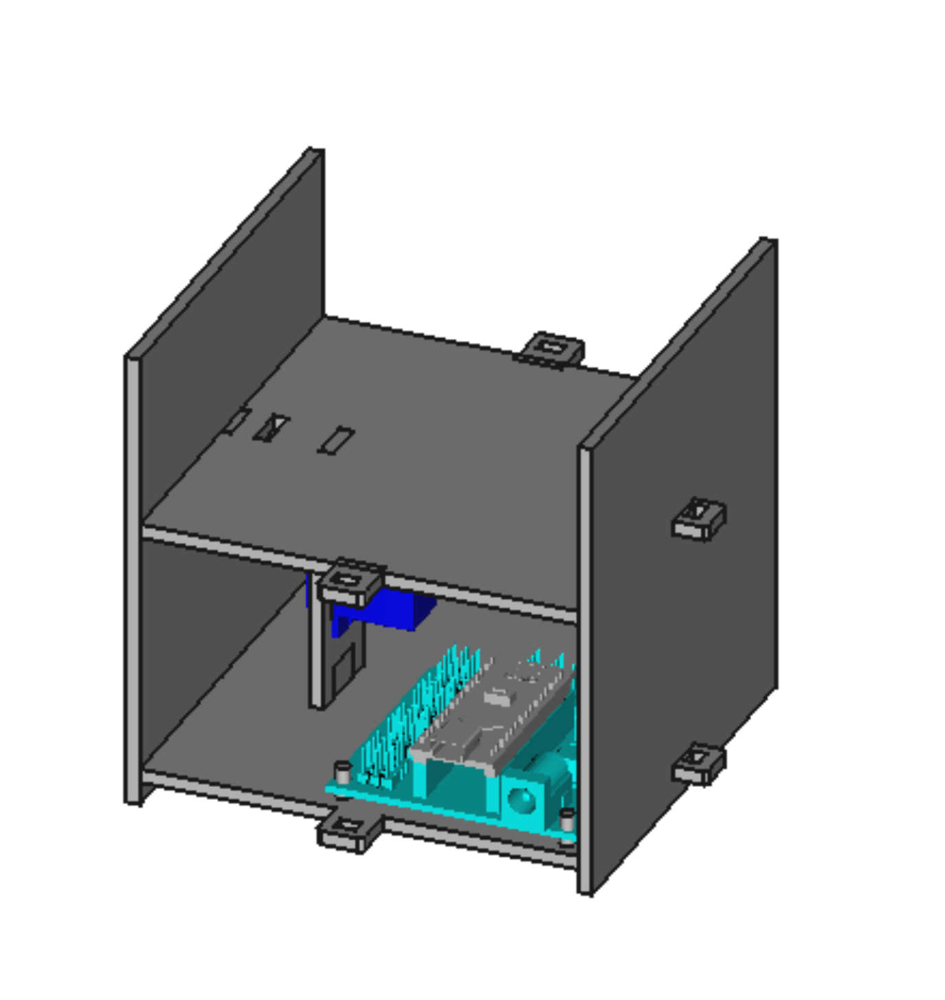

# Instrucciones de montaje

| Imagen | Descripción |
| --- | --- |
|  | Inserta la Arduino en el suelo de la caja y atornilla el servomotor SG-90 a su soporte. A continuación, encaja dicho soporte en el suelo con el eje del servo apuntando a la pared trasera. Coloca las paredes frontal y trasera tal y como se ve en el dibujo. |
|  | Encaja ahora la pieza que hemos llamado "doble fondo" tal y como se ve en la imagen. |
|  | Ha llegado el momento de realizar el conexionado. Encaja los dos piezos que tengas en la pared que quieras, coloca el interruptor y el LED en la pared lateral derecha y conecta de acuerdo a este esquema. |
|  | Vamos rematando. Ahora toca colocar las paredes laterales junto con la tapa. |
|  | Pon los pasadores para fijar todas las paredes. Ya casi tienes la Knockknockbox. |
|  |Por último, quita un momento de nuevo la pared trasera y pon el servo a 0º (si no sabes cómo, puedes utilizar [el programa de calibración que tienes disponible aquí para MasayloBlockly](./codigo/MasayloBlockly/calibracionSensorVibracion/calibracionKnockknockbox.bloc) [y aquí para la IDE de Arduino](./codigo/Arduino/calibracionKnockknockbox/calibracionKnockknockbox.ino)) y coloca uno de los horns que vienen con el servo. Con un poco de hilo de cobre o náilon, ata un extremo de este "cuerno" a la tapa. Vuelve a cerrar la Knockknockbox con la pared que habías quitado. ¡Bueno!. ¡Pues ya estaría!  |
