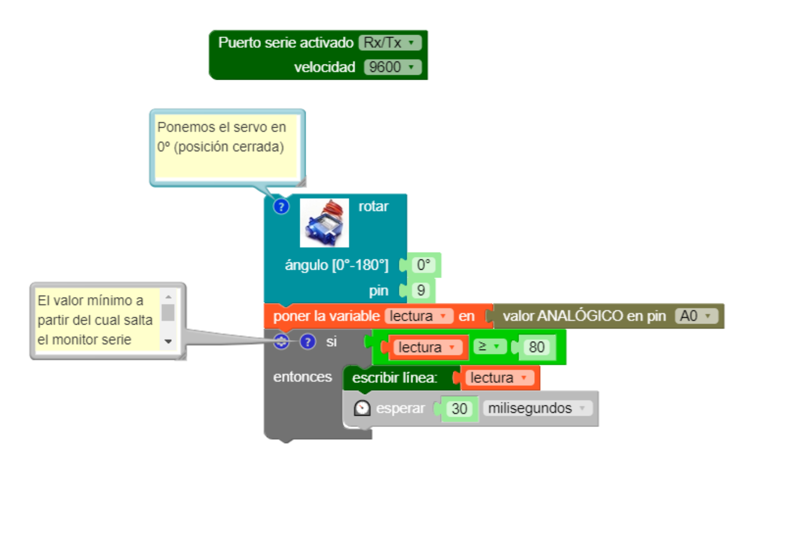
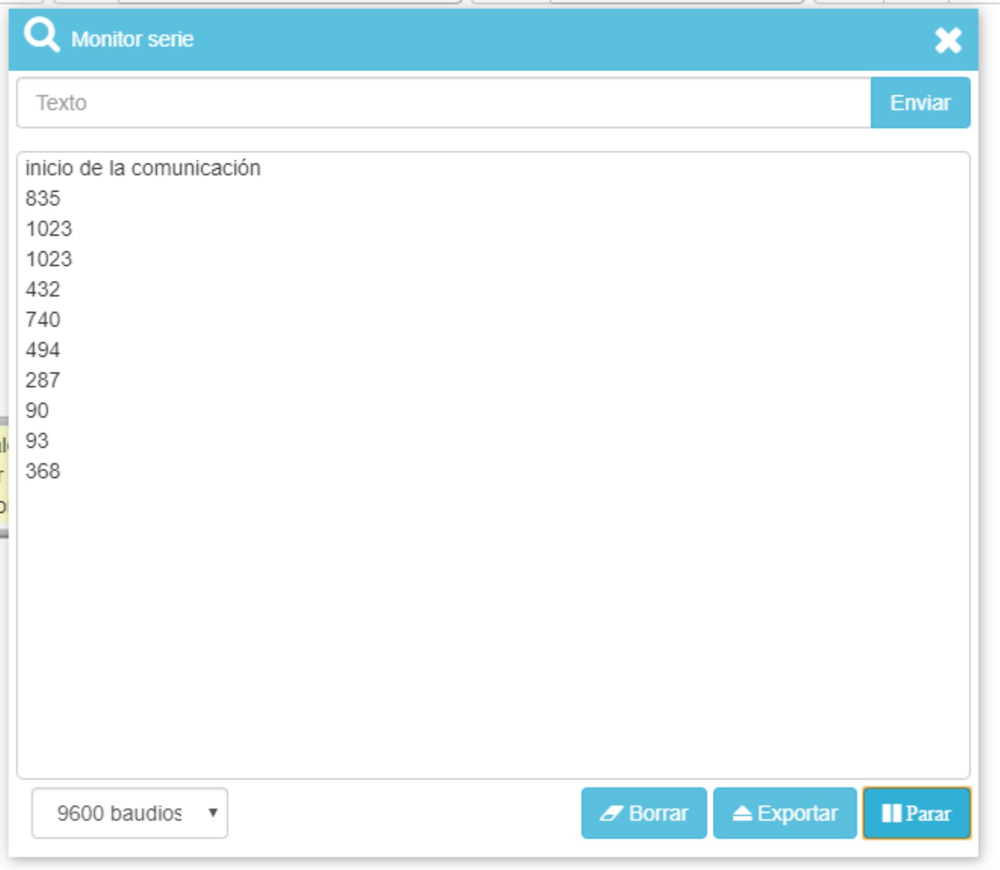
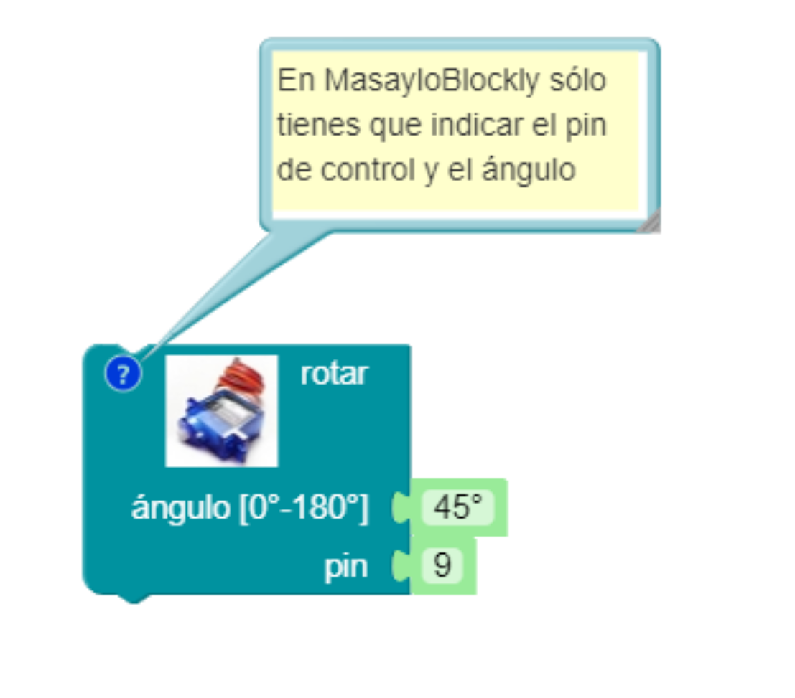

  # Calibrando la Knockknockbox

Para jugar con la Knockknockbox sólo necesitas saber dos cosas: el umbral de detección de golpe (además del tiempo de rebote) y la posición ideal del servo para abrir la caja.

## Umbral de detección del golpe
  
¿Qué valor, entre 0 y 1023, debe detectar el pin analógico A0 de la Arduino para decidir si realmente se ha dado un golpe en la pared donde tenemos el sensor?. Esto puede depender mucho del tipo de piezoeléctrico que estéis usando. En mi caso, suelo utilizar un valor intermedio como 512, y desde ahí voy subiendo o bajando en diversas pruebas de ensayo y error.
  
De todos modos, en la carpeta [código](../codigo/) os he dejado un programa de calibración. En MasayloBlockly es así:
  

  
    

    
Dicho programa coloca en 0º el servomotor (correspondiente a tapa cerrada, de modo que puedas colocar el horn del servo tal y como te indicaba antes y lo ates a la tapa en tensión) y espera a obtener un valor mayor de 80 (umbral relativamente pequeño, pero puedes cambiarlo) para devolver por el puerto serie el valor medido. Aquí tienes un ejemplo de mi propia calibración:

  

  
    

    
Como ves, en mi caso devuelve enseguida valores muy altos, así que para evitar falsas lecturas suelo utilizar umbrales del orden de 512 o mayores.

## Tiempo de rebote

Si has observado con atención el programa que te proponía antes, habrás notado que después de detectar un golpe, he establecido un pequeño retraso del orden de 30 milisegundos. Esto es debido porque poco después de recibir la vibración, el piezoeléctrico suele experimentar cierta realimentación, lo que hace que durante algunos milisegundos se siga enviando una falsa señal al pin analógico, lo que puede generar falsas lecturas. Por eso, *SIEMPRE* debes establecer un pequeño retraso (delay) justo después de que el programa decida que se ha recibido un golpe. Esto es lo que se conoce como *tiempo de rebote*. De nuevo, deberás decidir tú qué valor es el adecuado para que tu Knockknockbox no haga falsas lecturas. En mi caso, suelo trabajar entre 30 y 40 ms.

## Ángulo de apertura del servomotor

Este es quizás el aspecto que exige más cuidado de la calibración de la Knockknockbox. Ya sé que si pongo el servomotor a 0º, la tapa se mantendrá cerrada. Un valor que sé seguro que provocará la apertura de la caja es el máximo disponible, de 180 º que provocará que el horn de media vuelta y por lo tanto tire del hilo que provocará la apertura de la tapa. Ahora bien, dependiendo de la tensión con que haya atado el hilo, puedo encontrarme con que dicha posición genere una tensión excesiva que pueda provocar daños al servo, a la Knockknockbox o a ambos.

A este respecto, sólo puedo proponerte que vayas experimentando con diversos valores de apertura (por ejemplo, 45 º) y paulatinamente vayas decidiendo cuál puede ser la cifra adecuada. De nuevo, si usas MasayloBlockly lo tienes chupado:

  

  
    

    
