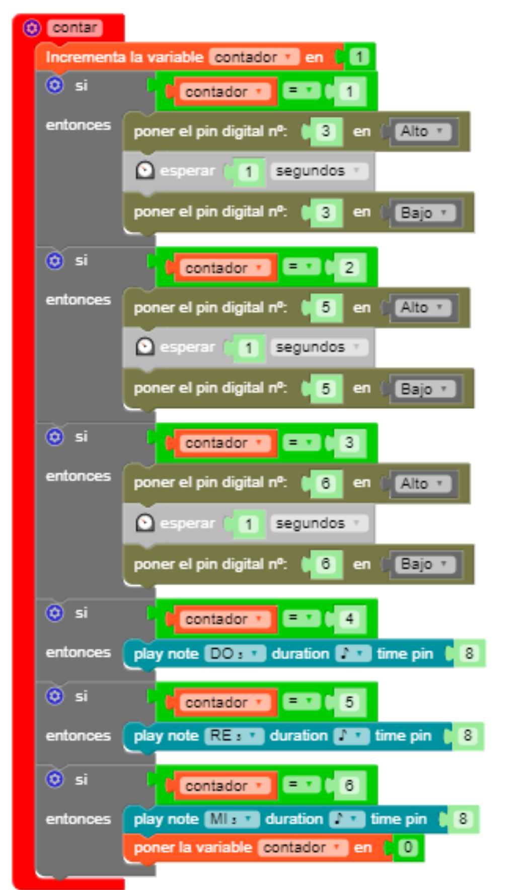

# Mi primer programa

Voy a dejarte sólamente un ejemplo que te permitirá familiarizarte con la Knockknockbox y sus posibilidades. Dicho programa tiene la siguientes características:

- Inicializa una variable de tipo entero llamada *contador* que empieza partiendo de 0. 
- El sensor de vibración detecta cada vez que damos un golpe. Espera 30 milisegundos (puedes cambiar el tiempo de rebote) y llama a la función **contar**, que irá aumentando el valor de *contador* de uno en uno. Según el valor de *contador*, cada vez que llamemos a **contar** sucederá una cosa distinta:
    - *1* encenderá el color rojo (pin 3) durante 1 segundo.
    - *2* encenderá el color verde (pin 5) durante 1 segundo.
    - *3* encenderá el color azul (pin 6) durante 1 segundo.
    - *4* hará que el altavoz (pin 8) toque la nota *Do*
    - *5* provocará la nota *Re*
    - *6* tocará la nota *Mi* y pondrá la variable *contador* a 0 para reiniciar el bucle.

El programa principal es sencillo:

  

  
    

    
En cuanto a la función **contar** (necesitaréis activar el bloque de opciones ***FUNCIONES*** de MasayloBlockly), si bien algo más larga (lo he hecho así para que resulte más sencillo de entender al neófito), tampoco es difícil de entender.

  

  
    

    
¿A que mola?. Os he dejado en la carpeta [codigo](../codigo/) este primer programa para que lo probéis por vuestra cuenta.

***TRUQUI Podéis probar a graduar la intensidad de luz de cada color del diodo RGB mediante PWM (ya sabes, valores entre 0 y 255). Si encima activas dos o los tres colores combinando intensidades, podéis generar un montón de colores distintos.***
