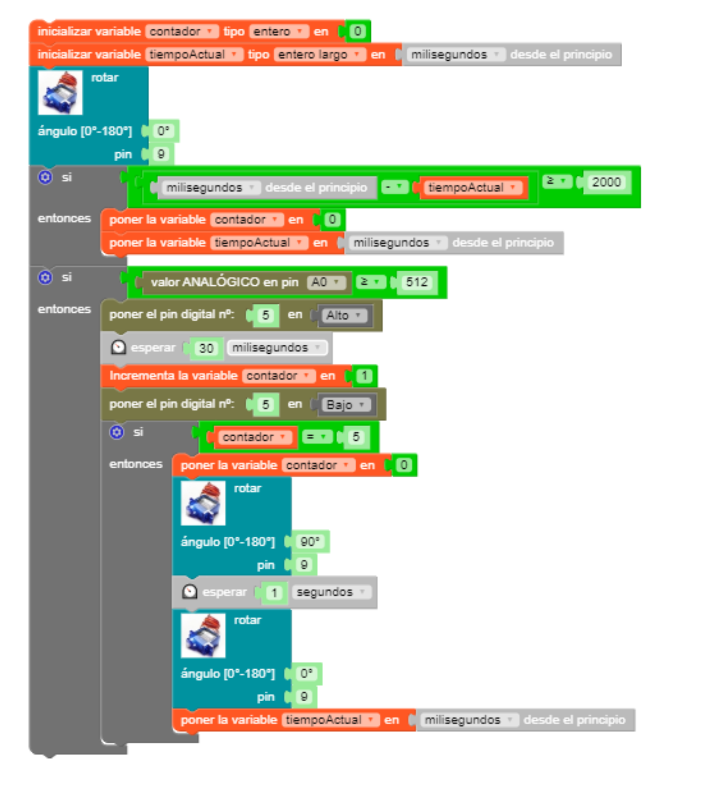

# Abrir y cerrar la caja

Con este último ejemplo acabaría la introducción a la Knockknockbox. De hecho, es incluso más sencillo que el ejemplo anterior. Consiste en contar, digamos, cinco golpes, y al acabar el quinto golpe la caja se abre durante un segundo (la ponemos, por ejemplo, a 90 º) para a continuación volver a cerrarse. Para darle algo de salsa al código, impondremos la condición de que esos cinco golpes tienen que darse antes de cos segundos (2000 ms). Para ello, volveremos a usar la variable *contador* y además añadiremos otra variable de tipo **long** a la que llamaremos **tiempoActual** que continuamente se comparará con un comando básico de Arduino llamado **millis()** que devuelve los milisegundos transcurridos desde que el sistema se activa. Además, activaremos momentáneamente uno de los colores (digamos, por ejemplo, el verde) con cada golpe.

  

  
    

    
De nuevo os he dejado en la carpeta [codigo](../codigo/) el programa, tanto en su formato para MasayloBlockly como para la IDE de Arduino. De nada.
    
