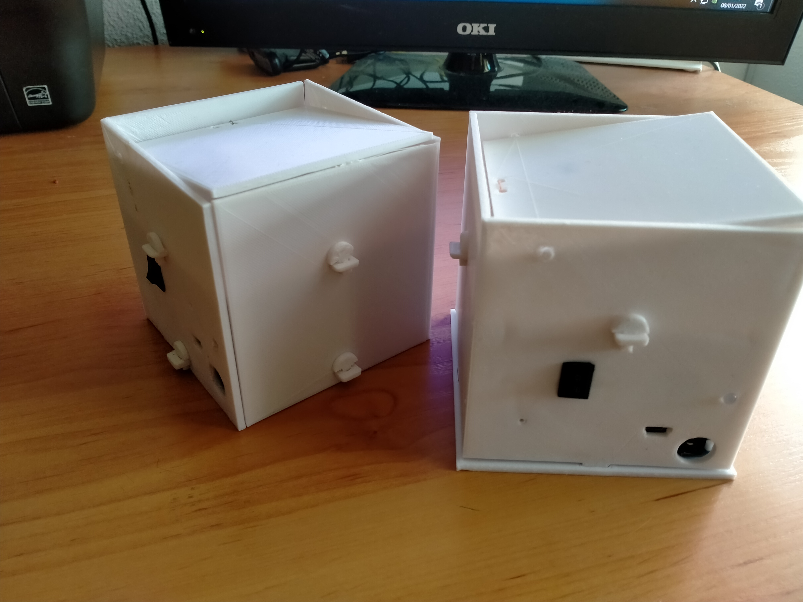
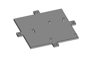
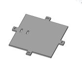
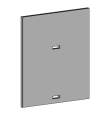
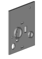
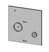
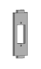
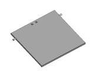
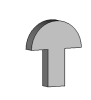
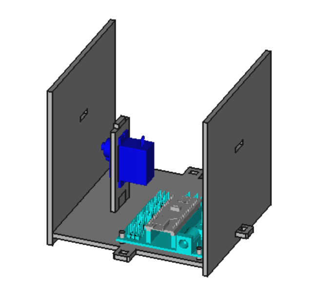

# Knockknockbox Español

Un rediseño (un homenaje, si lo prefieres) de la mítica #KnockKnockBox con la que hemos jugado en tantos centros educativos gracias a los talleres Verkstadt de David Cuartielles

## Lista de materiales
*Impresos en 3D*

| Pieza | Imagen |
| --- | --- |
| Suelo |  |
| Falso Techo |  |
| Paredes frontal y trasera (tendrás que imprimir dos veces) |  |
| Pared lateral derecha, o pared lateral activa (llamada así porque aloja el interruptor del portapilas) |  |
| Pared lateral izquierda, o pared lateral inerte (en contraposición a la denominación de activa) |  |
| Soporte del servomotor SG-90 |  |
| Tapa |  |
| Pasador (pequeños fijadores). Tendrás que imprimir 8|  |

*Electrónica (vitaminas)

| Pieza | Imagen |
| --- | --- |
| Arduino UNO o Arduino Nano con su correspondiente shield |  |
| Servomotor de posición SG-90 o similar|  |
| 2 piezoeléctricos pequeños (las piezas están equipadas para dos grandes o para dos pequeños) |  |
| (Alternativa) 2 piezoeléctricos grandes (las piezas están equipadas para dos grandes o para dos pequeños) |  |
| (Recomendable) 1 resistencia de 1 megaohmio o similar para proteger al piezo que hará de sensor de golpes |  |
| 1 diodo RGB de 5 mm (uno normal también vale, pero te dará menos juego, claro) |  |

## Instrucciones de montaje

| Imagen | Descripción |
| --- | --- |
|  | Inserta la Arduino en el suelo de la caja y atornilla el servomotor SG-90 a su soporte. A continuación, encaja dicho soporte en el suelo con el eje del servo apuntando a la pared trasera. Coloca las paredes frontal y trasera tal y como se ve en el dibujo. |

## Principio de funcionamiento

Para jugar con la **Knockknockbox** sólo hay que golpearla. El sensor de vibraciones del dispositivo detectará las vibraciones, y de acuerdo a su programa, raaccionará abriendo o cerrando la caja, activando los colores del diodo RGB, o emitiendo sonidos a través del otro piezoeléctrico (***NOTA PARA FRIKIS: Sí, claro que podríamos utilizar un único piezoeléctrico para que realizara las dos funciones, pero eso implica un mayor grado de dificultad para el aficionado medio, además de que de momento su programación con el IDE MasayloBlockly no sería posible con esta configuración... ¡No seas tacaño y gasta dos buzzer!***
## English

A redesign of the mytic #KnockKnockBox of the Verstakdt project by David Cuartielles
