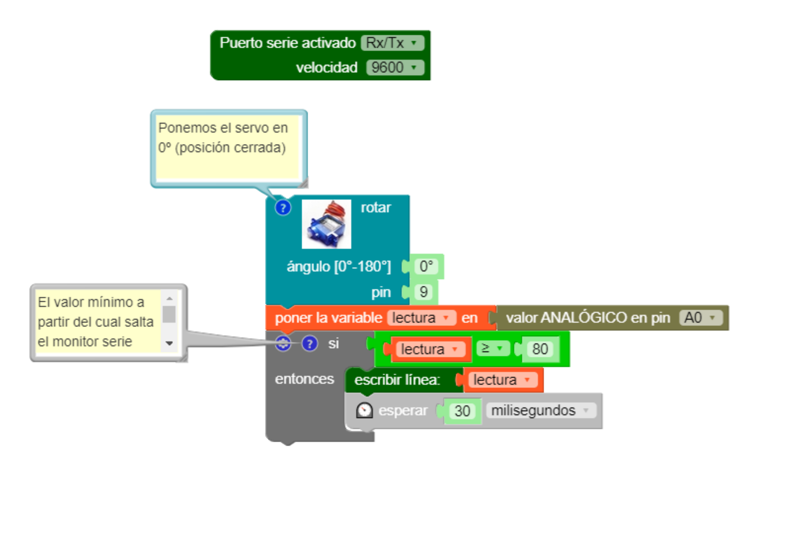
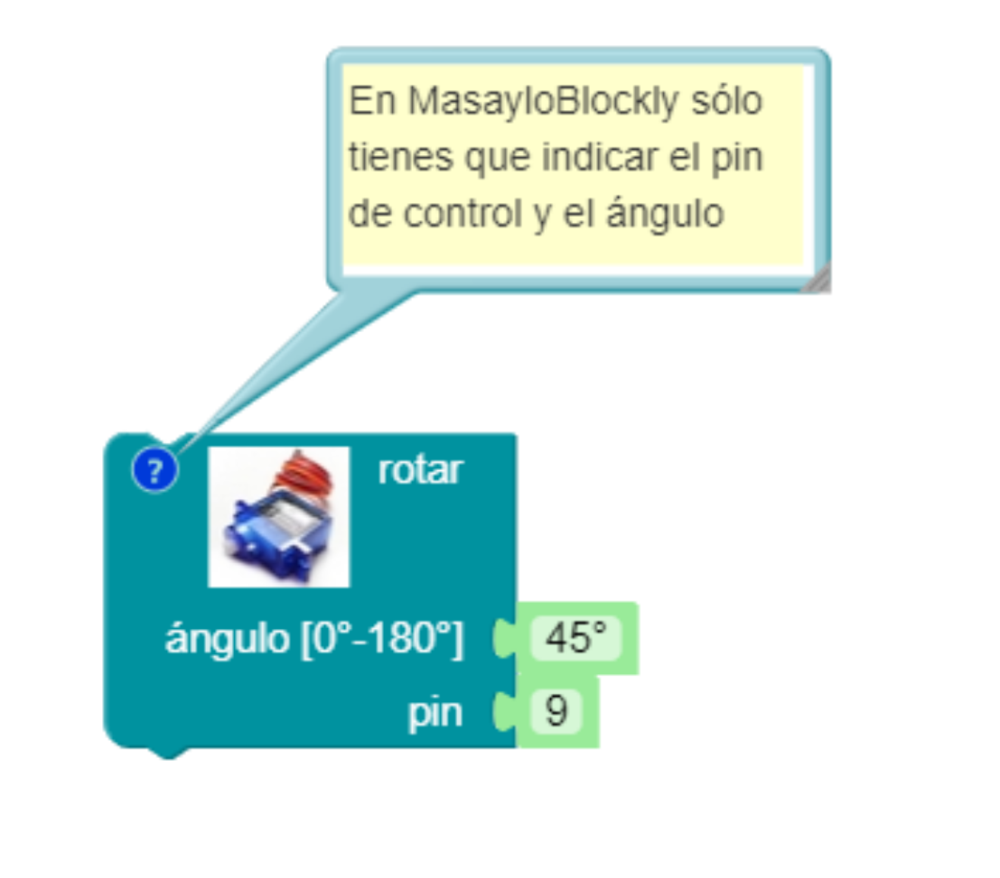

# Knockknockbox Español

Un rediseño (un homenaje, si lo prefieres) de la mítica #KnockKnockBox con la que hemos jugado en tantos centros educativos gracias a los talleres Verkstadt de David Cuartielles

## Lista de materiales
*Impresos en 3D*

| Pieza | Imagen |
| --- | --- |
| Suelo |  |
| Doble fondo |  |
| Paredes frontal y trasera (tendrás que imprimir dos veces) |  |
| Pared lateral derecha, o pared lateral activa (llamada así porque aloja el interruptor del portapilas) |  |
| Pared lateral izquierda, o pared lateral inerte (en contraposición a la denominación de activa) |  |
| Soporte del servomotor SG-90 |  |
| Tapa |  |
| Pasador (pequeños fijadores). Tendrás que imprimir 8|  |

*Electrónica (vitaminas)

| Pieza | Imagen |
| --- | --- |
| Arduino UNO o Arduino Nano con su correspondiente shield. |  |
| Servomotor de posición SG-90 o similar|  |
| 2 piezoeléctricos pequeños (las piezas están equipadas para dos grandes o para dos pequeños). |  |
| (Alternativa) 2 piezoeléctricos grandes (las piezas están equipadas para dos grandes o para dos pequeños).|  |
| (Recomendable) 1 resistencia de 1 megaohmio o similar para proteger al piezo que hará de sensor de golpes. |  |
| 1 diodo RGB de 5 mm (uno normal también vale, pero te dará menos juego, claro). |  |

## Instrucciones de montaje

| Imagen | Descripción |
| --- | --- |
|  | Inserta la Arduino en el suelo de la caja y atornilla el servomotor SG-90 a su soporte. A continuación, encaja dicho soporte en el suelo con el eje del servo apuntando a la pared trasera. Coloca las paredes frontal y trasera tal y como se ve en el dibujo. |
|  | Encaja ahora la pieza que hemos llamado "doble fondo" tal y como se ve en la imagen. |
|  | Ha llegado el momento de realizar el conexionado. Encaja los dos piezos que tengas en la pared que quieras, coloca el interruptor y el LED en la pared lateral derecha y conecta de acuerdo a este esquema. |
|  | Vamos rematando. Ahora toca colocar las paredes laterales junto con la tapa. |
|  | Pon los pasadores para fijar todas las paredes. Ya casi tienes la Knockknockbox. |
|  |Por último, quita un momento de nuevo la pared trasera y pon el servo a 0º (si no sabes cómo, puedes utilizar [el programa de calibración que tienes disponible aquí para MasayloBlockly](./codigo/MasayloBlockly/calibracionSensorVibracion/calibracionKnockknockbox.bloc) [y aquí para la IDE de Arduino](./codigo/Arduino/calibracionKnockknockbox/calibracionKnockknockbox.ino)) y coloca uno de los horns que vienen con el servo. Con un poco de hilo de cobre o náilon, ata un extremo de este "cuerno" a la tapa. Vuelve a cerrar la Knockknockbox con la pared que habías quitado. ¡Bueno!. ¡Pues ya estaría!  |

## Principio de funcionamiento

Para jugar con la **Knockknockbox** sólo hay que golpearla. El sensor de vibraciones del dispositivo detectará las vibraciones, y de acuerdo a su programa, raaccionará abriendo o cerrando la caja, activando los colores del diodo RGB, o emitiendo sonidos a través del otro piezoeléctrico (***NOTA PARA FRIKIS: Sí, claro que podríamos utilizar un único piezoeléctrico para que realizara las dos funciones, pero eso implica un mayor grado de dificultad para el aficionado medio, además de que de momento su programación con el IDE MasayloBlockly no sería posible con esta configuración... ¡No seas tacaño y gasta dos buzzer!***

Puedes programar la Knockknockbox como te de la gana. Si respetas el pinout que te proporciono (y, si tienes algún conocimiento de Arduino,no tienes por qué), tendrás un piezoeléctrico como sensor de vibración en la patilla analógica A0, otro más como altavoz en el pin digital 8, y los colores rojo, verde y azul del RGB conectados a las salidas digitales 3, 5 y 6 (no sólo por capricho, que también, sino por poder utilizar la característica PWM de estos pines). El servo que abre la caja está conectado a la patilla 9.

<image src="./PINOUT/esquemaConexionado.png" width="600">

  
##Calibrando la Knockknockbox

Para jugar con la Knockknockbox sólo necesitas saber dos cosas: el umbral de detección de golpe (además del tiempo de rebote) y la posición ideal del servo para abrir la caja.

### Umbral de detección del golpe
  
¿Qué valor, entre 0 y 1023, debe detectar el pin analógico A0 de la Arduino para decidir si realmente se ha dado un golpe en la pared donde tenemos el sensor?. Esto puede depender mucho del tipo de piezoeléctrico que estéis usando. En mi caso, suelo utilizar un valor intermedio como 512, y desde ahí voy subiendo o bajando en diversas pruebas de ensayo y error.
  
De todos modos, en la carpeta [código](./codigo/) os he dejado un programa de calibración. En MasayloBlockly es así:
  

  
    

    
Dicho programa coloca en 0º el servomotor (correspondiente a tapa cerrada, de modo que puedas colocar el horn del servo tal y como te indicaba antes y lo ates a la tapa en tensión) y espera a obtener un valor mayor de 80 (umbral relativamente pequeño, pero puedes cambiarlo) para devolver por el puerto serie el valor medido. Aquí tienes un ejemplo de mi propia calibración:

  

  
    

    
Como ves, en mi caso devuelve enseguida valores muy altos, así que para evitar falsas lecturas suelo utilizar umbrales del orden de 512 o mayores.

### Tiempo de rebote

Si has observado con atención el programa que te proponía antes, habrás notado que después de detectar un golpe, he establecido un pequeño retraso del orden de 30 milisegundos. Esto es debido porque poco después de recibir la vibración, el piezoeléctrico suele experimentar cierta realimentación, lo que hace que durante algunos milisegundos se siga enviando una falsa señal al pin analógico, lo que puede generar falsas lecturas. Por eso, *SIEMPRE* debes establecer un pequeño retraso (delay) justo después de que el programa decida que se ha recibido un golpe. Esto es lo que se conoce como *tiempo de rebote*. De nuevo, deberás decidir tú qué valor es el adecuado para que tu Knockknockbox no haga falsas lecturas. En mi caso, suelo trabajar entre 30 y 40 ms.

### Ángulo de apertura del servomotor

Este es quizás el aspecto que exige más cuidado de la calibración de la Knockknockbox. Ya sé que si pongo el servomotor a 0º, la tapa se mantendrá cerrada. Un valor que sé seguro que provocará la apertura de la caja es el máximo disponible, de 180 º que provocará que el horn de media vuelta y por lo tanto tire del hilo que provocará la apertura de la tapa. Ahora bien, dependiendo de la tensión con que haya atado el hilo, puedo encontrarme con que dicha posición genere una tensión excesiva que pueda provocar daños al servo, a la Knockknockbox o a ambos.

A este respecto, sólo puedo proponerte que vayas experimentando con diversos valores de apertura (por ejemplo, 45 º) y paulatinamente vayas decidiendo cuál puede ser la cifra adecuada. De nuevo, si usas MasayloBlockly lo tienes chupado:

  

  
    

    
## Mi primer programa

Voy a dejarte sólamente un ejemplo que te permitirá familiarizarte con la Knockknockbox y sus posibilidades. Dicho programa tiene la siguientes características:

- Inicializa una variable de tipo entero llamada *contador* que empieza partiendo de 0. 
- El sensor de vibración detecta cada vez que damos un golpe. Espera 30 milisegundos (puedes cambiar el tiempo de rebote) y llama a la función **contar**, que irá aumentando el valor de *contador* de uno en uno. Según el valor de *contador*, cada vez que llamemos a **contar** sucederá una cosa distinta:
    - *1* encenderá el color rojo (pin 3) durante 1 segundo.
    - *2* encenderá el color verde (pin 5) durante 1 segundo.
    - *3* encenderá el color azul (pin 6) durante 1 segundo.
    - *4* hará que el altavoz (pin 8) toque la nota *Do*
    - *5* provocará la nota *Re*
    - *6* tocará la nota *Mi* y pondrá la variable *contador* a 0 para reiniciar el bucle.

El programa principal es sencillo:

  

  
    

    
En cuanto a la función **contar** (necesitaréis activar el bloque de opciones ***FUNCIONES*** de MasayloBlockly), si bien algo más larga (lo he hecho así para que resulte más sencillo de entender al neófito), tampoco es difícil de entender.

  

  
    

    
¿A que mola?. Os he dejado en la carpeta [codigo](./codigo/) este primer programa para que lo probéis por vuestra cuenta.

***TRUQUI Podéis probar a graduar la intensidad de luz de cada color del diodo RGB mediante PWM (ya sabes, valores entre 0 y 255). Si encima activas dos o los tres colores combinando intensidades, podéis generar un montón de colores distintos.***

## Abrir y cerrar la caja

Con este último ejemplo acabaría la introducción a la Knockknockbox. De hecho, es incluso más sencillo que el ejemplo anterior. Consiste en contar, digamos, cinco golpes, y al acabar el quinto golpe la caja se abre durante un segundo (la ponemos, por ejemplo, a 90 º) para a continuación volver a cerrarse. Para darle algo de salsa al código, impondremos la condición de que esos cinco golpes tienen que darse antes de cos segundos (2000 ms). Para ello, volveremos a usar la variable *contador* y además añadiremos otra variable de tipo **long** a la que llamaremos **tiempoActual** que continuamente se comparará con un comando básico de Arduino llamado **millis()** que devuelve los milisegundos transcurridos desde que el sistema se activa.  
## English

A redesign of the mytic #KnockKnockBox of the Verstakdt project by David Cuartielles
